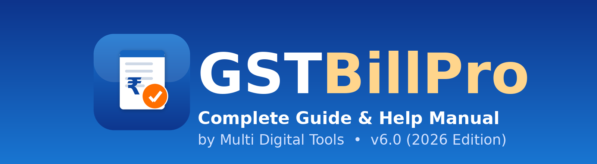
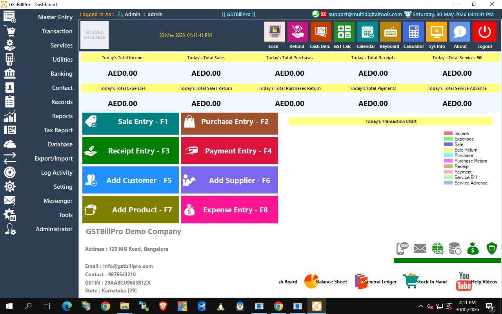
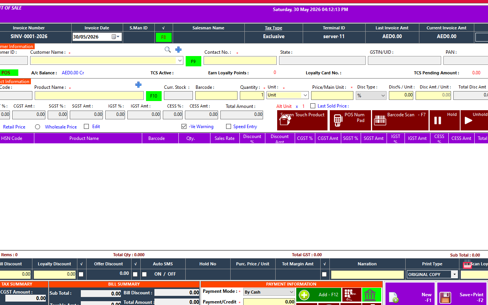

  

<h1 align="center">GSTBillPro — GST Billing, Inventory & Accounting (POS)</h1>

  <b>Complete GST billing, point-of-sale, inventory and accounting suite for Indian business.</b> 
  Windows desktop · SQL Server · One-time perpetual licence · <b>14-day free trial</b>

  
  &nbsp;
  

---

## 🆓 14-Day Free Trial

Try **every feature** free for **14 days** — no credit card required.

1. **[Download the installer](https://github.com/multidigitaltools/GSTBillPro/releases/latest)** (or use the **Download Free Trial** button on the [product page](https://multidigitaltools.com/products/gstbill)).
2. On the product page, enter your **email** → you get a **6-digit code** → verify → receive your **14-day licence key** instantly.
3. Install, launch GSTBillPro, and paste the key on the activation screen. You're running the full product for 14 days.

When the trial ends, [purchase a lifetime licence](https://multidigitaltools.com/products/gstbill) — your data stays exactly where it is.

---

## ✨ Features

- **GST invoicing** — CGST / SGST / IGST / CESS, HSN codes, auto round-off, TCS, e-Way Bill details
- **One-click GST returns** — GSTR-1 and GSTR-3B (B2B, B2CL, B2CS, HSN summaries)
- **Fast retail POS** — thermal (58/80mm) + A4 invoices, cash drawer, barcode & QR labels, touch product grid, hold/unhold
- **Inventory & stock** — current stock, reorder points, stock adjustment, damage, low-stock alerts
- **Purchase, sales, quotations, estimates, purchase orders & returns** — all GSTR-linked
- **Full accounting** — Balance Sheet, Profit & Loss, Trial Balance, day book, cash/bank/customer/supplier ledgers, outstanding
- **Communication** — send invoices & reminders over WhatsApp, SMS and email
- **Multi-company** support, **auto-backup**, Excel import/export, multi-user roles & permissions
- **White-label reseller program** — rebrand and sell GSTBillPro as your own (see below)

  
  

---

## 💰 Pricing

| Edition | Price | What you get |
|---|---|---|
| **Full licence** | **$85 one-time** | Lifetime perpetual licence + **1 year of updates** (new versions) |
| **14-day trial** | **Free** | Full functionality for 14 days, email-verified |
| **Reseller (white-label)** | **$999 one-time** | Generate **unlimited** end-user licence keys under your own brand + 1 year of updates |

👉 Buy or start your trial at **https://multidigitaltools.com/products/gstbill**

---

## 🖥️ System Requirements

- Windows 10 / 11 / Server (64-bit)
- Microsoft **SQL Server** or SQL Server **Express** (free)
- The installer bundles the **.NET** app, the **Crystal Reports runtime**, and all report templates — no separate downloads needed.

## ⬇️ Install

1. Download **GSTBillPro-Setup.exe** from [Releases](https://github.com/multidigitaltools/GSTBillPro/releases/latest).
2. Run it — the wizard installs the app, report engine and report templates, and creates Start-menu / desktop shortcuts.
3. Launch GSTBillPro. On first run it guides you to connect to SQL Server and create your company database automatically.
4. Activate with your **trial** or **full** licence key.

📘 **Full step-by-step guide:** [docs/USER_GUIDE.md](docs/USER_GUIDE.md) · online docs: https://multidigitaltools.com/products/gstbill/docs

---

## 🏷️ Become a Reseller (White-Label)

Sell GSTBillPro under **your own brand**: set your product name, logo, colours and contact details, generate **unlimited** end-user licence keys, and build a branded installer — no coding. **$999 one-time**, includes 1 year of updates.

➡️ [Become a reseller](https://multidigitaltools.com/products/gstbill) · guide: [docs/RESELLER_GUIDE.html](docs/RESELLER_GUIDE.html)

---

## 📨 Support

- Website: https://multidigitaltools.com/products/gstbill
- Email: **support@multidigitaltools.com**

---

© 2026 Multi Digital Tools · GSTBillPro is proprietary software. See <a href="LICENSE.txt">LICENSE</a>.

