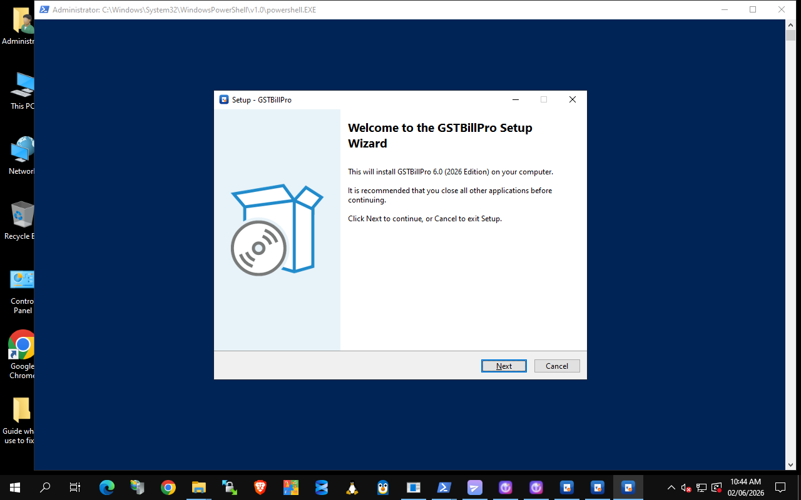
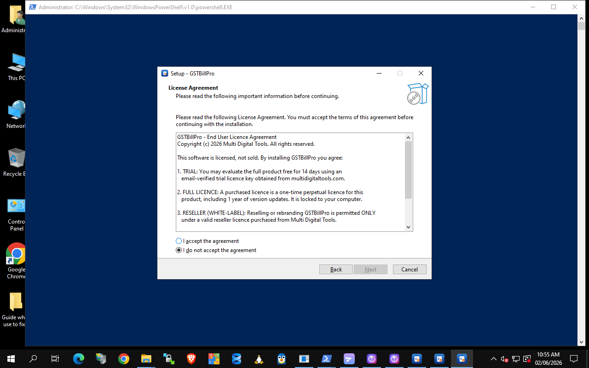
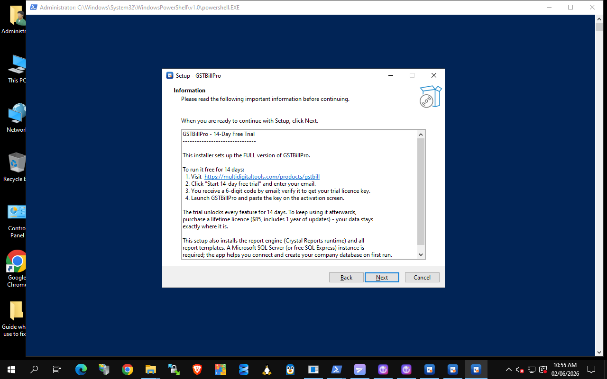
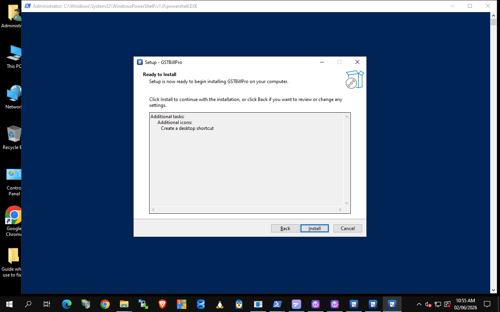

# GSTBillPro — Installation Guide

GSTBillPro ships as a single Windows installer (`GSTBillPro-Setup.exe`) that sets up the app, the report engine (Crystal Reports runtime) and all report templates. A Microsoft **SQL Server** or free **SQL Server Express** instance is required.

## 1. Download
Get **GSTBillPro-Setup.exe** from the [latest release](https://github.com/multidigitaltools/GSTBillPro/releases/latest) (or the **Download Free Trial** button on the [product page](https://multidigitaltools.com/products/gstbill)).

## 2. Run the setup wizard

**Welcome** — confirms the version and starts the install.

**Licence Agreement** — read and accept the EULA (covers trial, full and reseller use).

**14-day free trial info** — how to get your trial licence key.

**Choose location & install** — pick the folder, then install. Setup also installs the Crystal Reports runtime and copies all 76 report templates and the database setup scripts.

## 3. First run
Launch **GSTBillPro**. On first run it guides you to connect to SQL Server and creates your company database automatically.

## 4. Activate
- **Trial:** on the [product page](https://multidigitaltools.com/products/gstbill), click *Start 14-day free trial*, enter your email, verify the 6-digit code, and you get a 14-day licence key. Paste it on the activation screen.
- **Full:** purchase a lifetime licence ($85) and activate with the key you receive.

## System requirements
- Windows 10 / 11 / Server (64-bit)
- Microsoft SQL Server or SQL Server Express
- ~250 MB free disk space

Support: **support@multidigitaltools.com**
