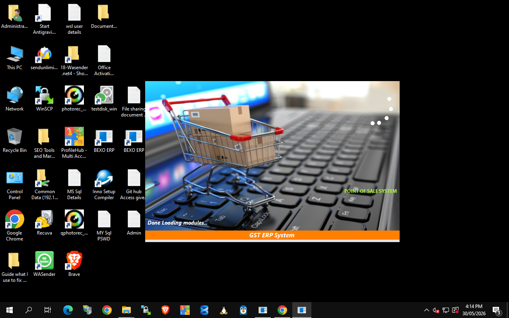
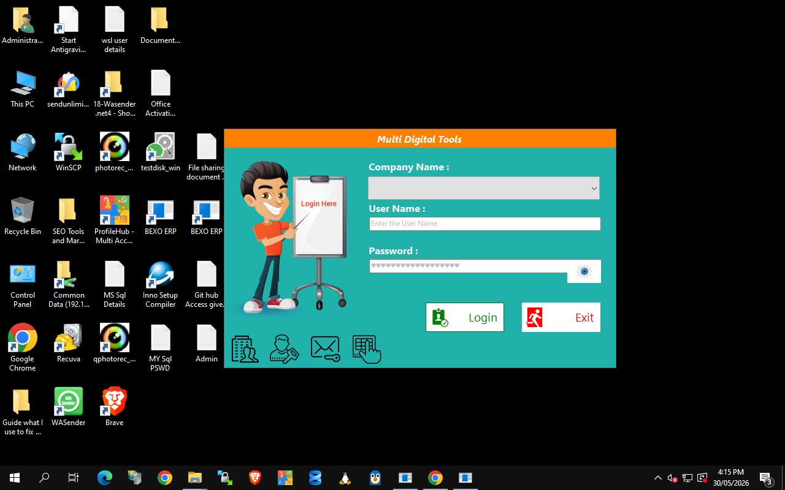
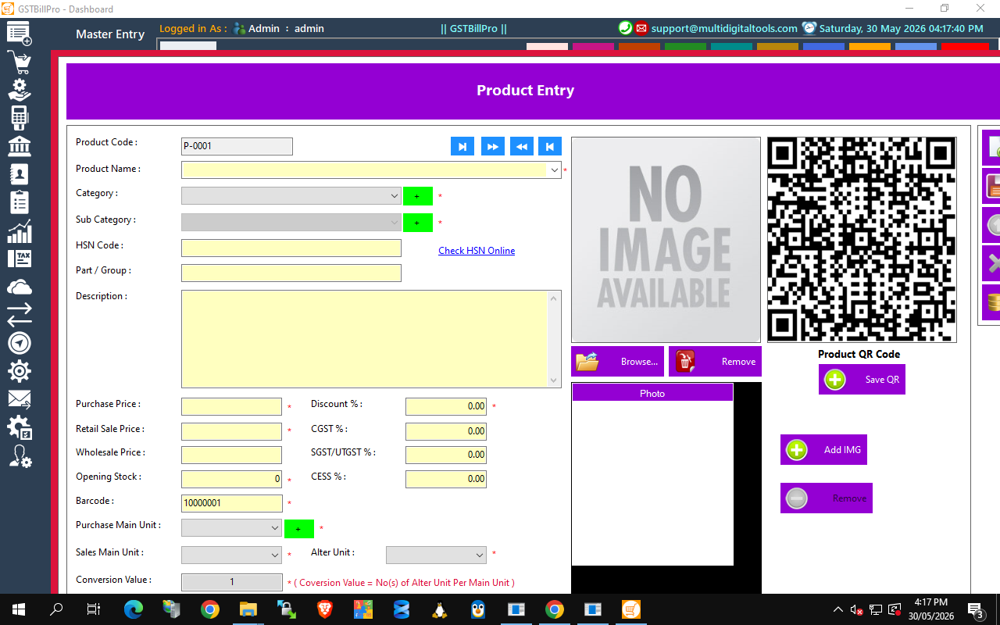
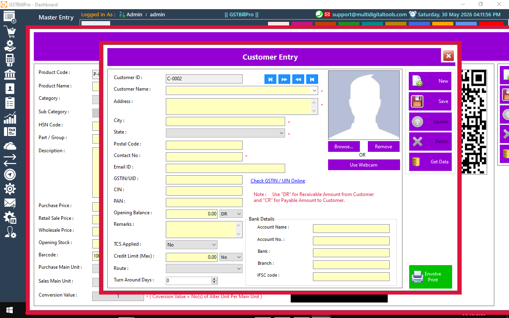
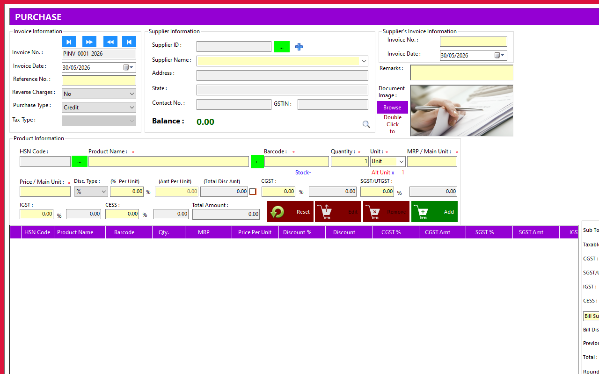
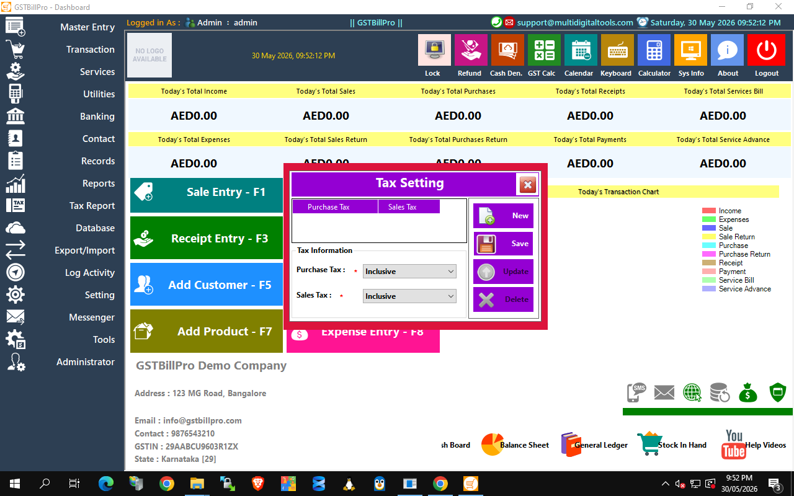

# GSTBillPro — Complete User Guide
### GST Billing, Inventory & Accounting — Point of Sale System
**Version 6.0 • 2026 Edition** — by **Multi Digital Tools**
🌐 https://multidigitaltools.com/products/gstbill • ✉ support@multidigitaltools.com

---

Welcome! GSTBillPro is an all-in-one billing solution for Indian businesses — sales & POS, purchases,
inventory, GST (CGST/SGST/IGST/CESS), accounting and reports. This guide walks the complete journey
with real screenshots. Keyboard shortcuts **F1–F8** open the most-used screens instantly from the Dashboard.

**Contents:** 1. Start · 2. Login · 3. Dashboard · 4. Product · 5. Customer · 6. Supplier ·
7. Sale (POS) · 8. Purchase · 9. Receipt · 10. Payment · 11. Expense · 12. Reports & GST

---

## 1. Starting the software
Double-click the **GSTBillPro** icon. The startup screen loads modules and checks your licence.

> **First run:** you'll be guided to set up the SQL Server connection and create your company. After that it goes straight to login.

## 2. Logging in
Pick your **Company**, enter **User Name** and **Password**, click **Login**.

- **Company Name** — choose the business (multiple companies supported).
- **Roles** — Admin / Sales Person / Inventory Manager, each sees only what's allowed.
- **Default admin:** `admin` / `admin` — change it under *Administrator → Change Password*.

## 3. The Dashboard
Your home base — left menu opens every module, coloured tiles are one-click shortcuts, the top strip shows today's totals.

Shortcuts: **F1** Sale · **F2** Purchase · **F3** Receipt · **F4** Payment · **F5** Customer · **F6** Supplier · **F7** Product · **F8** Expense.

---

## 4. Add a Product — F7
Create what you sell; code, barcode and QR are auto-generated.

- Name, Category/Sub-category (green **+** adds new), **HSN code**, prices, **opening stock**, **GST rates** (CGST/SGST/CESS), units.
- Click **Save** → barcode & QR generated. Use *Check HSN Online* for the right code/rate.

## 5. Add a Customer — F5
Store customers once, reuse on every invoice.

- Name, address, contact, email; **GSTIN/UIN, PAN, CIN** (validate with *Check GSTIN Online*).
- Opening balance (DR/CR), credit limit, bank details, photo (Browse/Webcam).

## 6. Add a Supplier — F6
Record vendors you buy from (same layout as Customer).

---

## 7. Make a Sale (POS) — F1
The heart of the system — bill a customer in seconds with full GST.

- Pick customer → scan barcode / type product (price, stock, GST auto-fill).
- Set qty & discount → CGST/SGST/IGST/CESS calculated live per line.
- Enter payment (**F12**), then **Save + Print** (**F2**). Stock & ledgers update automatically.
- Speed tools: Screen-Touch grid, POS Num-Pad, Barcode Scan (**F7**), Hold/Unhold.

## 8. Record a Purchase — F2
Enter stock bought from suppliers — inventory ↑, supplier ledger & GST input recorded.

## 9. Receive a Payment (Receipt) — F3
Record money received from a customer against outstanding bills.

## 10. Make a Payment — F4
Record money paid to a supplier; ledger and cash/bank balance update instantly.

## 11. Record an Expense — F8
Log running costs (rent, electricity, salaries…) so profit stays accurate.

---

## 12. Reports & GST Returns
Everything you record flows into ready-made reports (**Reports** and **Tax Report** menus, or Dashboard footer).

- **Business:** Sales, Purchase, Stock In Hand, Best/Low-selling, Salesman commission.
- **Accounting:** General Ledger, Day Book, Trial Balance, Profit & Loss, Balance Sheet.
- **GST:** GSTR-1, GSTR-3B, tax summaries, TCS.
- Every report prints or exports to Excel/PDF. Pick a date range — figures reconcile automatically.

---

## 13. Settings & Administration
Open the **Setting**, **Database** and **Administrator** menus to tailor GSTBillPro.

- **Tax Setting** — Purchase & Sales tax Inclusive/Exclusive of GST.
- **Company Information** — name, address, GSTIN, logo, financial year.
- **Users & Roles / Permissions** — Admin / Sales Person / Inventory Manager; per-user menu control.
- **Change Password** — secure (PBKDF2) per-user password change.
- **Email / SMS Setting** — connect SMTP & SMS gateway for invoices and alerts.
- **Printer / Terminal Setting** — invoice printer & POS terminal ID.
- **Auto Backup** — schedule automatic database backups.
- **Virtual / Multi-Company** — run and switch between multiple businesses.

## 14. Full feature list
- **Billing & POS:** POS, thermal & A4/A5 invoices, barcode, hold/unhold, touch grid, loyalty, discounts.
- **Quotations & Estimates**, **Purchase & Stock** (orders, adjustment, damage), **Returns** (credit/debit notes), **Services**.
- **Accounting:** receipts, payments, vouchers, cash/bank/customer/supplier ledgers, outstanding.
- **GST & Tax:** CGST/SGST/IGST/CESS, TCS, GSTR-1, GSTR-3B.
- **Reports:** P&L, Balance Sheet, Trial Balance, General Ledger, Day Book + Excel/PDF export.
- **Communication:** Email/SMS/WhatsApp, bulk messaging. **Data:** multi-company, auto backup, Excel import/export, activity log.

---

## Good to know
- **F1–F8** from the Dashboard = instant access to daily screens.
- Create staff users under *Administrator → Users* with per-role permissions.
- *Database → Auto Backup* keeps data safe — schedule daily.
- Run multiple companies from one install; switch at login.
- Amounts follow Windows region — set the PC to **India** to show **₹**.

**Requirements:** Windows 10/11/Server (.NET 4.8) · Microsoft SQL Server/Express · report runtime (installed by setup).

---
© 2026 **Multi Digital Tools** — https://multidigitaltools.com/products/gstbill — support@multidigitaltools.com
